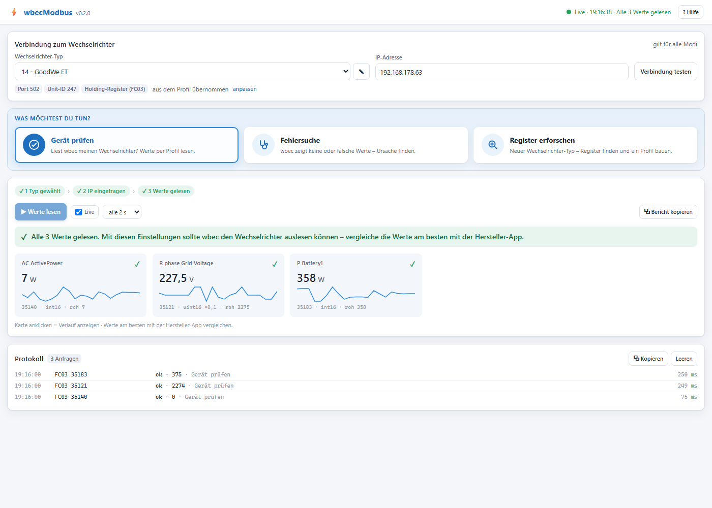
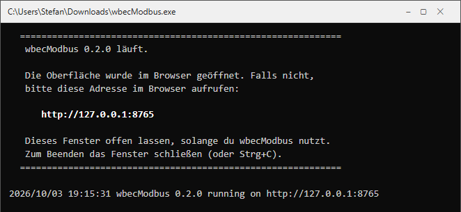
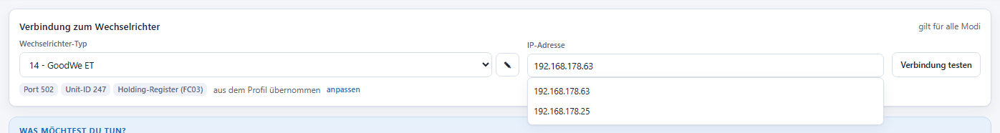
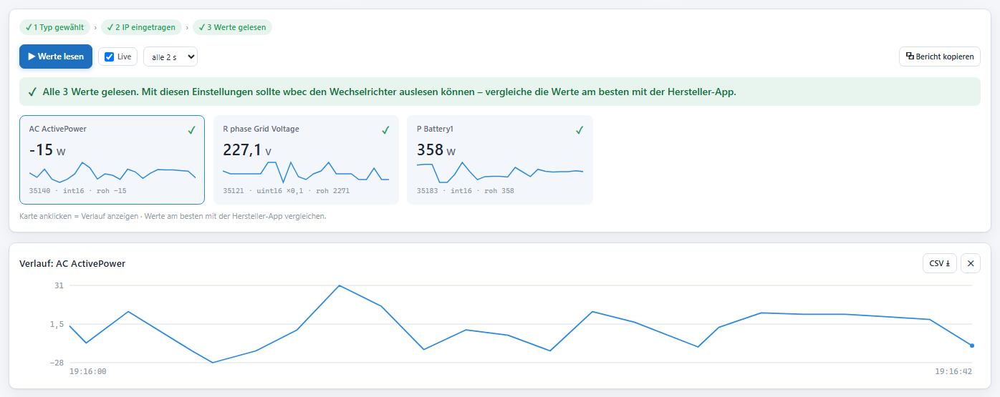
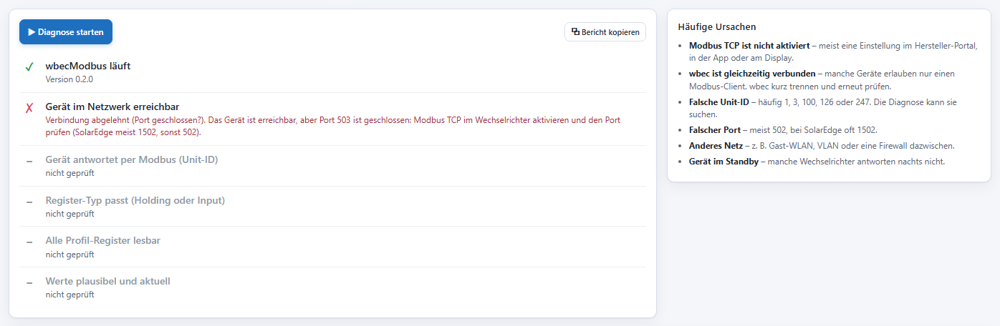
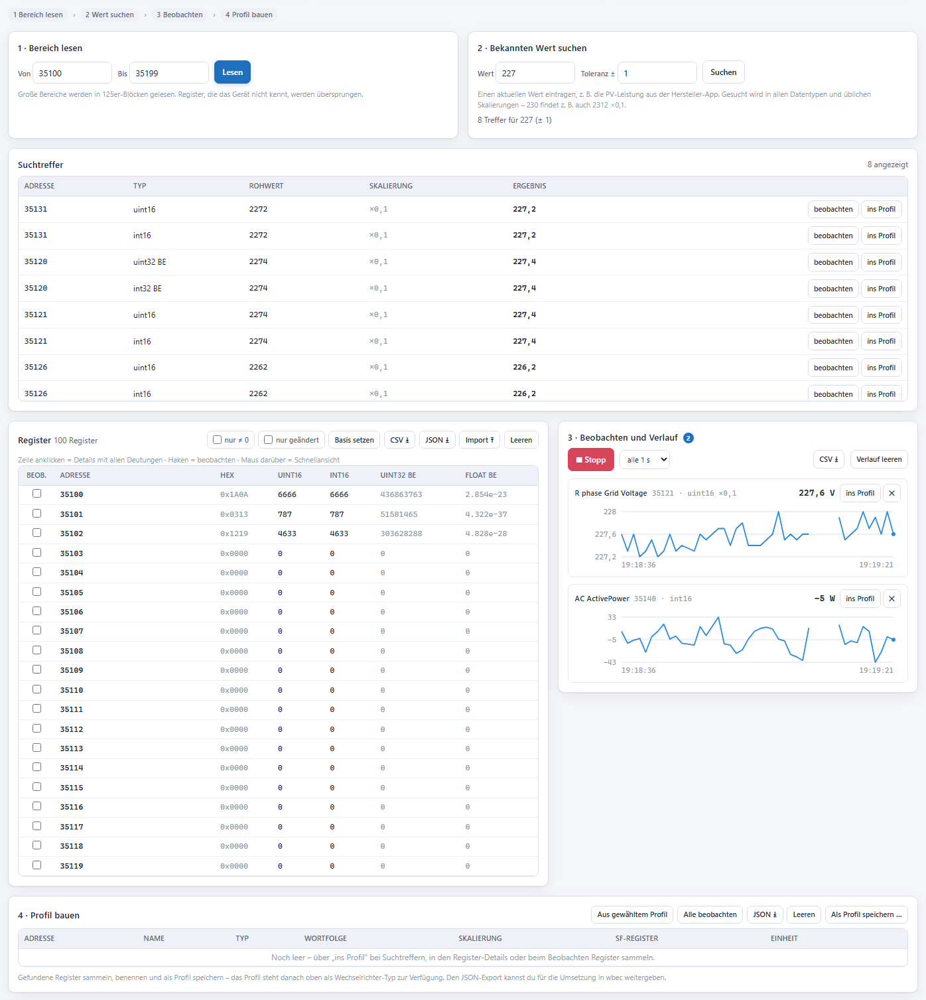

# wbecModbus

**Prüfe in wenigen Minuten, ob [wbec](https://github.com/steff393/wbec) deinen Wechselrichter auslesen kann – ganz ohne Installation.**

wbecModbus ist ein kleines Windows-Programm, das Werte deines Wechselrichters (oder Stromzählers) per
Modbus TCP ausliest und im Browser anzeigt. Es **liest nur** – am Gerät wird nichts verändert.

Es hilft dir bei drei Dingen:

| | Modus | Wann? |
|---|---|---|
| ✅ | **Gerät prüfen** | Dein Wechselrichter wird von wbec unterstützt und du willst sehen, ob die Werte ankommen. |
| 🩺 | **Fehlersuche** | wbec zeigt keine oder falsche Werte – du willst wissen, woran es liegt. |
| 🔍 | **Register erforschen** | Dein Wechselrichter wird noch nicht unterstützt – du willst herausfinden, wo seine Werte stehen. |

---

## In 3 Schritten loslegen

### 1. Herunterladen und starten

1. `wbecModbus.exe` unter **[Releases](../../releases)** herunterladen.
2. Doppelklick auf die Datei. Es öffnet sich ein schwarzes Fenster – **bitte offen lassen**.
3. Die Oberfläche öffnet sich automatisch im Browser. Falls nicht, im Browser
   **<http://127.0.0.1:8765>** aufrufen (die Adresse steht auch im schwarzen Fenster).

> **Windows-Warnung?** Beim ersten Start meldet Windows evtl. „Der Computer wurde durch Windows geschützt“.
> Dann auf **Weitere Informationen → Trotzdem ausführen** klicken.

### 2. Verbindung einstellen

Oben in der Verbindungsleiste:

1. **Wechselrichter-Typ** wählen – denselben, den du auch in wbec einstellst.
   Port, Unit-ID und Register-Typ werden automatisch übernommen.
2. **IP-Adresse** deines Wechselrichters eintragen (steht z. B. in deinem Router).
   Sie wird gemerkt – beim nächsten Mal reicht ein Klick ins Feld.

### 3. Werte lesen

Im Modus **Gerät prüfen** auf **▶ Werte lesen** klicken. Jeder Wert erscheint als Karte mit Einheit:

- **Grün:** Alle Werte gelesen – wbec sollte deinen Wechselrichter auslesen können.
  Vergleiche die Werte am besten mit der App deines Herstellers.
- **Gelb/Rot:** Etwas klappt nicht – ein Klick auf **Zur Fehlersuche** hilft weiter.

Mit **Live** werden die Werte laufend aktualisiert; ein Klick auf eine Karte zeigt den Verlauf.

---

## Es klappt nicht? → Fehlersuche

Im Modus **Fehlersuche** auf **▶ Diagnose starten** klicken. wbecModbus prüft Schritt für Schritt,
wo es hakt – und sagt dir, was zu tun ist. Die richtige **Unit-ID** kann es sogar selbst suchen.

Die häufigsten Ursachen:

- **Modbus TCP ist im Wechselrichter nicht aktiviert** (Einstellung in der Hersteller-App, im Portal oder am Display).
- **wbec ist gleichzeitig verbunden** – manche Geräte erlauben nur eine Verbindung. wbec kurz trennen.
- **Falsche Unit-ID oder falscher Port** (SolarEdge z. B. meist Port 1502).
- **Anderes Netz**, z. B. Gast-WLAN.

---

## Für Fortgeschrittene: neuen Wechselrichter erforschen

Wird dein Wechselrichter noch nicht unterstützt, kannst du im Modus **Register erforschen** selbst
herausfinden, wo seine Werte stehen:

1. **Bereich lesen**, z. B. die Register 35000–35199.
2. **Bekannten Wert suchen**: die aktuelle Leistung aus der Hersteller-App eingeben – wbecModbus findet
   passende Register, auch mit Skalierung (z. B. 2312 × 0,1 = 231,2 V).
3. **Beobachten**: Treffer laufend lesen und als Diagramm verfolgen.
4. **Profil bauen**: gefundene Register benennen, speichern und als JSON für die Umsetzung in wbec weitergeben.

---

## Gut zu wissen

- **Sicher:** wbecModbus ist nur auf deinem PC erreichbar und sendet ausschließlich Lesebefehle –
  Einstellungen am Wechselrichter können nicht verändert werden.
- **Portabel:** keine Installation, eine einzige Datei. Gespeicherte Profile landen im Ordner `profiles`
  neben der EXE.
- **Beenden:** einfach das schwarze Fenster schließen.
- **Ausführliche Anleitung:** [docs/HILFE.md](docs/HILFE.md) oder der Knopf **? Hilfe** oben rechts im Programm.
- **Entwickler:** Aufbau, Build und HTTP-API stehen in [docs/ENTWICKLUNG.md](docs/ENTWICKLUNG.md).
